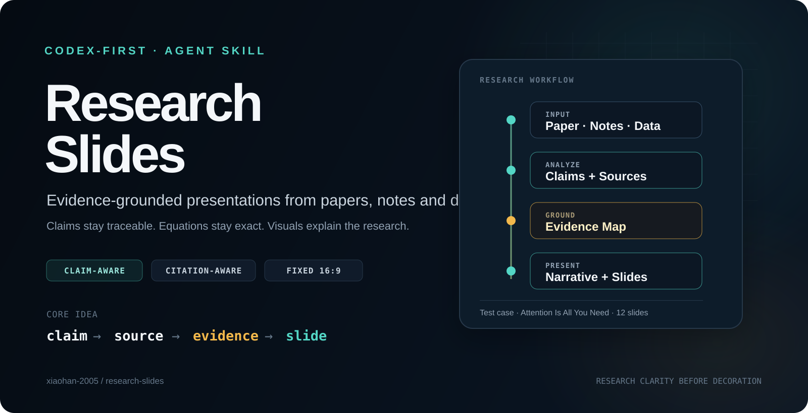
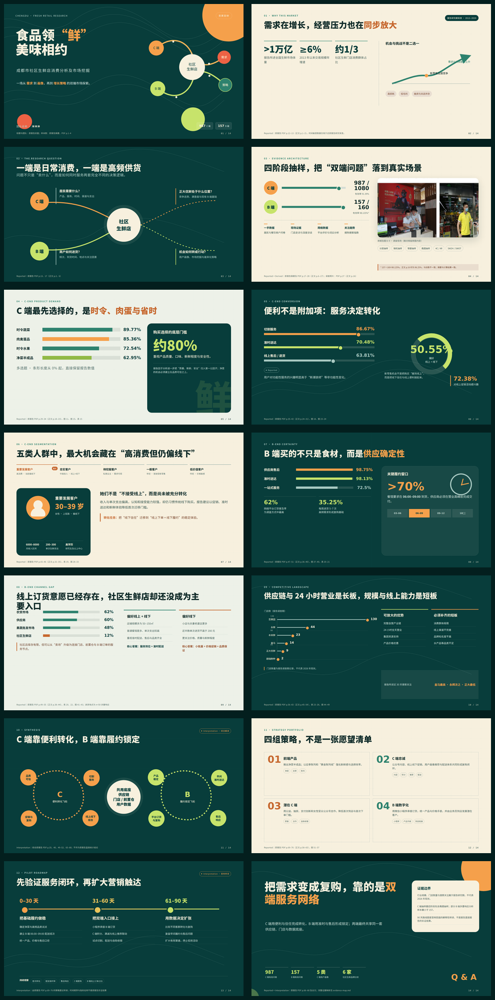
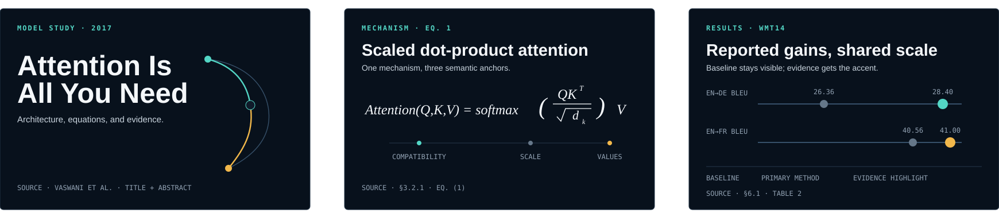
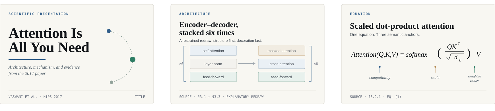
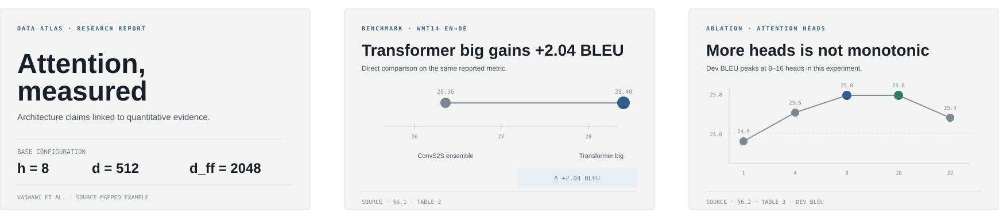
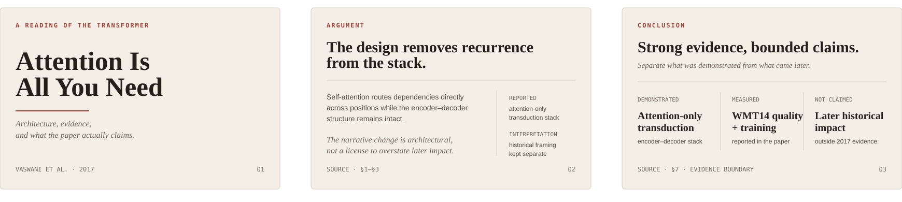
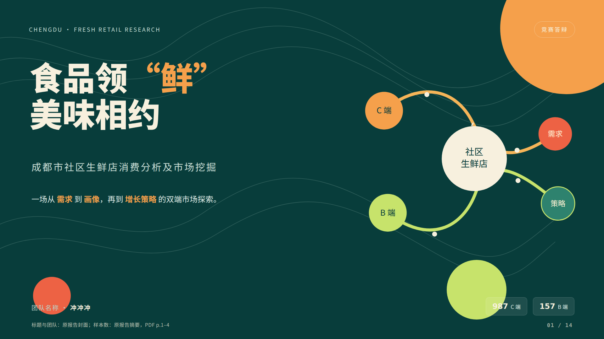

# Research Slides

> **Turn papers, research notes and data into evidence-grounded, citation-aware presentations with Codex.**

[](https://github.com/xiaohan-2005/research-slides/stargazers)
[](LICENSE)




<div align="center">

**Codex-first · claim-aware · citation-aware · fixed 16:9**

[**Start with the Skill**](SKILL.md) · [**Competition defense case**](examples/chengdu-fresh-market-defense/README.md) · [**Technical paper case**](examples/attention-is-all-you-need/README.md)

If this workflow helps your research, teaching or competition prep, **⭐ star the repository** — it helps more people discover the project.

</div>

---

## See it in action

<a href="examples/chengdu-fresh-market-defense/README.md">
  
</a>

**A 100-page Chinese national first-prize market-research paper → a 14-slide, speaker-led competition defense deck.** The case keeps survey evidence, fieldwork imagery, quantitative claims and source inconsistencies traceable instead of hiding them behind polished visuals.

[**Explore the full case →**](examples/chengdu-fresh-market-defense/README.md) · [**Open the HTML deck**](examples/chengdu-fresh-market-defense/output/presentation.html) · [**Read the source paper**](examples/chengdu-fresh-market-defense/source-paper.pdf) · [**Inspect the evidence map**](examples/chengdu-fresh-market-defense/analysis/evidence-map.md)

---

## The 10-second idea

Most AI slide workflows optimize for **speed and appearance**.

Research Slides adds a second requirement:

> **Important claims should remain traceable to evidence.**

```text
claim  →  source  →  evidence  →  slide
```

It is a Codex-first Agent Skill for academic and technical presentations. Instead of treating a paper like generic text to summarize, it preserves **claims, sources, equations, figures, quantitative results and limitations** while turning the material into a visual research story.

## Quick start

| | Goal | Start here |
| --- | --- | --- |
| **USE** | Run the workflow with Codex | [`SKILL.md`](SKILL.md) |
| **TRY** | Inspect real paper-to-deck test cases | [`Chengdu fresh-market defense`](examples/chengdu-fresh-market-defense/README.md) · [`Attention Is All You Need`](examples/attention-is-all-you-need/README.md) |
| **UNDERSTAND** | See how evidence stays traceable | [`claim-ledger.md`](examples/attention-is-all-you-need/analysis/claim-ledger.md) → [`evidence-map.md`](examples/attention-is-all-you-need/analysis/evidence-map.md) |
| **VERIFY** | Inspect what passed and what is still pending | [`validation/report.md`](examples/attention-is-all-you-need/validation/report.md) |

### Use from a local checkout

```bash
git clone https://github.com/xiaohan-2005/research-slides.git
cd research-slides
```

Open the repository in Codex and ask it to follow the workflow in `SKILL.md`.

Example:

```text
Use the research-slides skill in this repository.
Turn this paper into a 12-slide group-meeting presentation.
Use speaker-led density.
Keep every important quantitative claim traceable to its source.
Show me three real title-slide previews before building the full deck.
```

> This repository is currently alpha. The workflow is usable, while extraction tooling and browser-level validation are still being expanded.

---

## Why it is different

```text
Paper / Notes / Data
        ↓
Evidence extraction
        ↓
Claim ledger
        ↓
Narrative design
        ↓
Visual discovery
        ↓
1920×1080 HTML deck
        ↓
Evidence + structural + visual validation
```

### Research-aware generation

- **Narrative, not transcription** — reorganizes source material around the scientific question and evidence.
- **Claim-aware** — separates reported findings, derived values, interpretation and background context.
- **Citation-aware** — maps important claims, numbers, figures and equations back to their sources.
- **Figure-aware** — treats figures as evidence rather than decoration.
- **Equation-aware** — preserves mathematical meaning and distinguishes source equations from explanatory annotations.

### Visual discovery, not style guessing

Research Slides does not begin by asking the user to describe an abstract aesthetic.

It follows a progressive visual-selection loop:

```text
STYLE_PRESETS.md
        +
selection-index.json
        ↓
shortlist metadata
        ↓
preview.md only
        ↓
3 real title-slide previews
        ↓
user selects a direction
        ↓
load exactly one design.md
        ↓
generate the full deck
```

The preview slides use the user's **real title and context**. They must not expose internal labels such as `Option A`, template names, file paths or workflow metadata.

---

## Research Style Gallery

The gallery is for people; the runtime design files are for Codex. Each visual direction below is backed by a real `preview.md + design.md` pair in the template pack.

### Neural Lab



> Dark computational research field · architecture, equations, ablations, model evidence · cyan logic + amber evidence.

### Scientific Minimal



> Publication-adjacent light system · figure-first composition · serif statements, hairline rules, restrained scientific annotation.

### Data Atlas



> Quantitative research system · direct labels, visible baselines, uncertainty-aware charts, exact comparisons.

### Editorial Academic



> Warm scholarly editorial system · conceptual argument, literature review, policy analysis, source-led narrative.

These are deliberately different **visual grammars**, not one template with four accent palettes.

[`Browse the template pack →`](research-template-pack/README.md)

---

### Fixed-stage presentation runtime

Every final deck is authored at exactly **1920×1080** and scales as one stage.

It does not turn into a vertically stacked mobile webpage.

- keyboard navigation;
- touch/swipe navigation when feasible;
- progress/page feedback outside the authored slide canvas;
- reduced-motion support;
- source labels that remain part of the scientific interface.

---

## Skill architecture

`SKILL.md` is the executable workflow. Detailed resources are loaded only when the task needs them.

```text
research-slides/
├── AGENTS.md
├── SKILL.md
│
├── RESEARCH_RULES.md
├── STYLE_PRESETS.md
├── SLIDE_SYSTEM.md
├── viewport-base.css
├── html-template.md
├── animation-patterns.md
│
├── research-template-pack/
│   ├── README.md
│   ├── selection-index.json
│   └── templates/
│       ├── neural-lab/
│       │   ├── preview.md
│       │   └── design.md
│       ├── scientific-minimal/
│       │   ├── preview.md
│       │   └── design.md
│       ├── data-atlas/
│       │   ├── preview.md
│       │   └── design.md
│       └── editorial-academic/
│           ├── preview.md
│           └── design.md
│
├── assets/
│   └── style-gallery/
│       ├── neural-lab.svg
│       ├── scientific-minimal.svg
│       ├── data-atlas.svg
│       └── editorial-academic.svg
│
├── scripts/
│   └── validate_slides.py
│
└── examples/
    ├── chengdu-fresh-market-defense/
    │   ├── README.md
    │   ├── source-paper.pdf
    │   ├── analysis/evidence-map.md
    │   ├── output/presentation.html
    │   ├── preview/
    │   └── validation/report.md
    └── attention-is-all-you-need/
        ├── README.md
        ├── slide-outline.md
        ├── citations.md
        ├── analysis/
        │   ├── claim-ledger.md
        │   └── evidence-map.md
        ├── output/
        │   └── presentation.html
        └── validation/
            └── report.md
```

### Progressive disclosure

| File | Job | Load when |
| --- | --- | --- |
| [`SKILL.md`](SKILL.md) | executable workflow and trigger logic | entry point |
| [`RESEARCH_RULES.md`](RESEARCH_RULES.md) | evidence, citation, figure and equation integrity | evidence extraction + validation |
| [`STYLE_PRESETS.md`](STYLE_PRESETS.md) | safe academic visual systems | style discovery |
| [`research-template-pack/selection-index.json`](research-template-pack/selection-index.json) | lightweight template metadata | candidate selection |
| `templates/<slug>/preview.md` | lightweight visual recipe | shortlisted candidates only |
| `templates/<slug>/design.md` | full implementation-grade design system | selected template only |
| [`viewport-base.css`](viewport-base.css) | fixed 1920×1080 stage | generation |
| [`html-template.md`](html-template.md) | HTML/controller architecture | generation |
| [`animation-patterns.md`](animation-patterns.md) | research-specific motion grammar | generation |
| [`scripts/validate_slides.py`](scripts/validate_slides.py) | deterministic static checks | validation |

---

## End-to-end test cases

### Competition defense — Chengdu community fresh market



This case converts a 100-page Chinese national first-prize market-research paper into a 14-slide, speaker-led competition defense deck.

It demonstrates:

- mixed C-side consumer and B-side merchant evidence;
- direct-labeled survey charts and fieldwork imagery;
- explicit handling of a response-rate inconsistency in the source;
- strategy slides clearly labeled as interpretation;
- a standalone HTML output with embedded fonts and research assets;
- completed desktop and phone fixed-stage validation.

Useful entry points:

- [`case README`](examples/chengdu-fresh-market-defense/README.md)
- [`standalone HTML deck`](examples/chengdu-fresh-market-defense/output/presentation.html)
- [`original national first-prize paper`](examples/chengdu-fresh-market-defense/source-paper.pdf)
- [`slide-level evidence map`](examples/chengdu-fresh-market-defense/analysis/evidence-map.md)
- [`validation report`](examples/chengdu-fresh-market-defense/validation/report.md)

### Attention Is All You Need

The first test case uses Vaswani et al. (2017) to exercise the workflow, rather than showing only a finished slide deck.

It includes:

- a 12-slide research narrative;
- a claim ledger;
- a slide-level evidence map;
- source-aware equations and quantitative results;
- original explanatory HTML/CSS/SVG visuals;
- a canonical Neural Lab 1920×1080 output;
- a validation report that records passes, failures and pending checks.

Useful entry points:

- [`test-case README`](examples/attention-is-all-you-need/README.md)
- [`claim ledger`](examples/attention-is-all-you-need/analysis/claim-ledger.md)
- [`evidence map`](examples/attention-is-all-you-need/analysis/evidence-map.md)
- [`canonical deck source`](examples/attention-is-all-you-need/output/presentation.html)
- [`validation report`](examples/attention-is-all-you-need/validation/report.md)

Current status:

```text
Evidence validation          PASS
Static validator             PASS — executed
Neural Lab migration         COMPLETE
Static rendered visual QA    PASS
Browser interaction QA       PENDING
Release-ready                 NO
```

The example stays non-release-ready until browser-level interaction and viewport behavior are verified in an unrestricted browser environment.

---

## Validate a generated deck

Run the deterministic static validator before visual review:

```bash
python scripts/validate_slides.py path/to/presentation.html
```

It checks common contract failures such as:

- missing `deck-viewport` / `deck-stage`;
- wrong authored dimensions;
- missing slide elements;
- missing keyboard navigation;
- missing reduced-motion handling;
- missing local assets;
- obvious responsive slide reflow.

Passing the script does **not** prove that the deck looks correct. Rendered inspection is still required for clipping, overlap, figure legibility, equations and citations.

---

## Research integrity contract

Research Slides should fail safely rather than manufacture confidence.

It must not:

- invent a citation;
- invent a numerical result;
- silently change a reported value;
- alter an equation's meaning for layout convenience;
- present interpretation as a source-reported finding;
- misrepresent a redraw as an original paper figure;
- hide an unresolved provenance problem behind polished design.

When evidence is incomplete, mark it as incomplete.

---

## Current status

Completed:

- [x] Codex-oriented `SKILL.md`
- [x] repository `AGENTS.md`
- [x] research-integrity rules
- [x] progressive visual discovery engine
- [x] four implementation-grade research visual systems
- [x] public Research Style Gallery
- [x] fixed 1920×1080 stage contract
- [x] HTML presentation architecture
- [x] research animation guidance
- [x] static slide validator
- [x] first traceable paper-to-deck test case
- [x] Attention canonical deck migrated to Neural Lab
- [x] competition-defense case with original paper, standalone deck and phone QA

Next engineering priorities:

- [ ] browser-based visual validation automation
- [ ] PDF structure / figure extraction
- [ ] machine-readable claim/source schema
- [ ] citation verification tooling
- [ ] data / notebook → research deck workflow
- [ ] additional test cases with different research structures
- [ ] expand the gallery only with genuinely different research design grammars

## Design philosophy

**Research clarity before decoration. Evidence before confidence. Visuals before walls of text.**

A slide is not finished when it looks convincing. It is finished when the argument is clear **and** the important evidence can still be traced.

## License

MIT — see [`LICENSE`](LICENSE).
